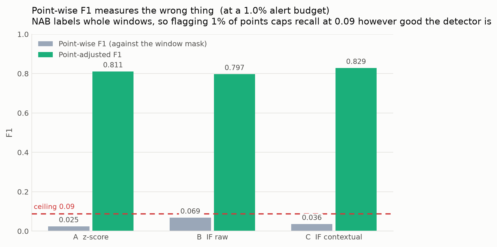
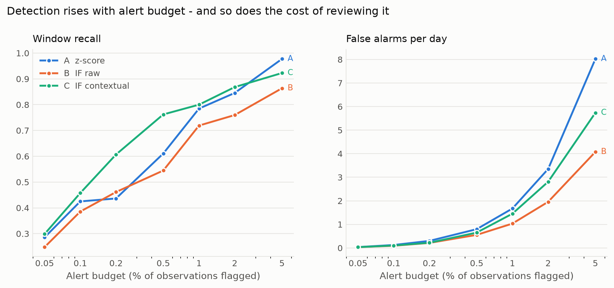
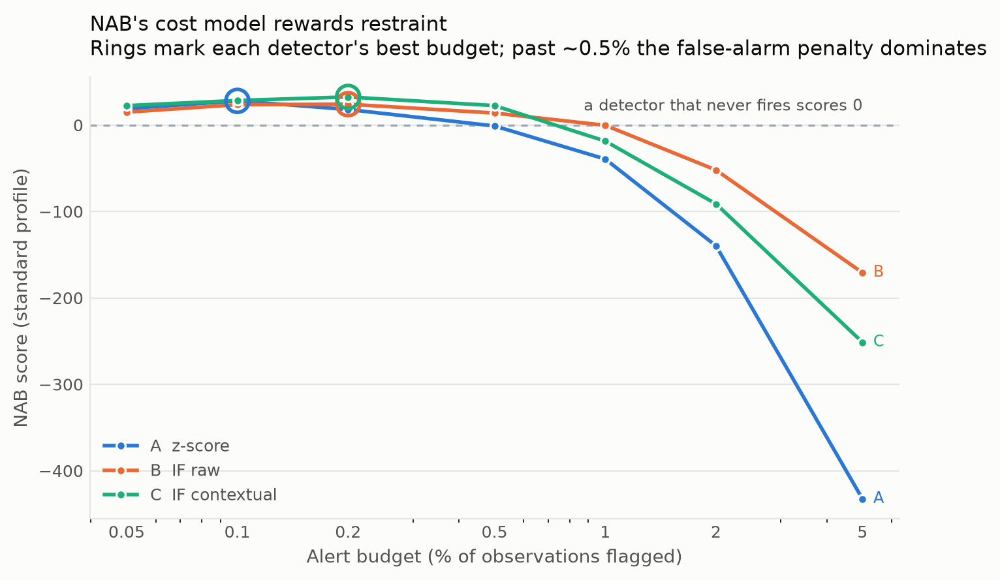
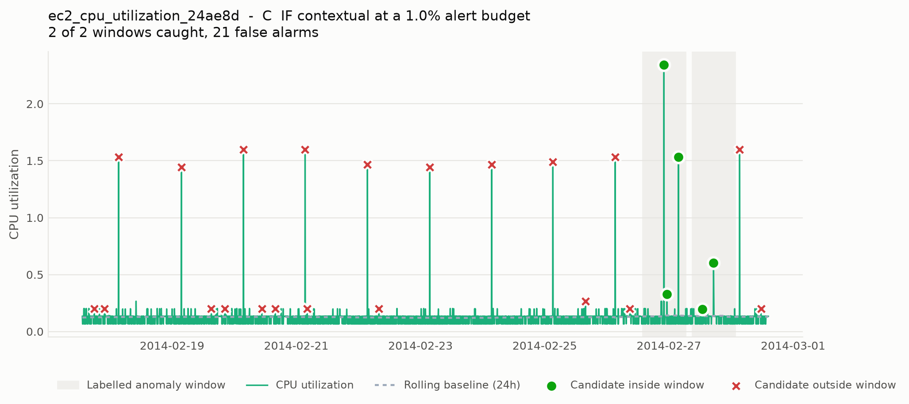

# IT Operations Anomaly Analytics

**Anomaly Detection and Performance Analytics in IT Operations Using Data Visualization**

A reproducible harness for comparing anomaly detectors on operational time-series
data, evaluated at window, point-adjusted and alert-cost levels, with an
interactive dashboard for analyst review.

MSc Data Science dissertation project · Karnataka State Open University, Mysuru
Author: Shravana K (08P241017000009) · Guide: Dr. Nandhini H M · 2025–26 July cycle

---

## Contents

- [What this project argues](#what-this-project-argues)
- [Quick start](#quick-start)
- [The problem with the obvious approach](#the-problem-with-the-obvious-approach)
- [Architecture](#architecture)
- [The three detectors](#the-three-detectors)
- [Experimental protocol](#experimental-protocol)
- [How the metrics work](#how-the-metrics-work)
- [Results](#results)
- [The dashboard](#the-dashboard)
- [Repository layout](#repository-layout)
- [Module reference](#module-reference)
- [Testing](#testing)
- [Reproducing everything](#reproducing-everything)
- [Limitations](#limitations)
- [Mapping to the synopsis objectives](#mapping-to-the-synopsis-objectives)
- [References](#references)

---

## What this project argues

> An anomaly detector in IT operations does not output anomalies. It outputs a
> **ranked stream of candidate events** that a human must triage under a time
> budget. The job of the analysis is therefore to measure the quality of that
> stream — detection *and* alert cost — and to present it with enough context
> for review.

Three consequences shape every design decision in this repository:

1. **Score, don't classify.** Detectors emit a continuous anomaly score, never a
   label. Thresholding is a separate, explicit step, which is what makes the
   budget sweep, the PR curves and the dashboard's operating-point slider
   possible.
2. **Alert, don't flag.** Contiguous flagged points are grouped into *incident
   candidates*. An analyst pays attention once per incident, not once per
   sample, so that is the unit in which false-alarm cost is counted.
3. **Measure at three levels**, because they answer three different questions:

   | Level | Question | Metric |
   |---|---|---|
   | Window | Did we catch the incident at all? | window recall |
   | Point-adjusted | How well did we cover it once caught? | point-adjusted P/R/F1 |
   | Operational | What did catching it cost? | false alarms/day, MTTD |

   Plus the official **NAB score** (three application profiles) as an external
   yardstick.

**Contribution.** This project does not propose a new detection algorithm. It
contributes a reproducible evaluation harness that (i) measures detection at
window, point-adjusted and alert-cost levels rather than point-wise alone,
(ii) isolates the contribution of temporal context by holding the model fixed
and varying only the feature representation, and (iii) exposes the
recall/false-alarm trade-off through an interactive threshold control, making
the operating-point decision visible to an analyst rather than hidden in a
hyperparameter.

---

## Quick start

```bash
git clone https://github.com/shravanajayanth/IT_Operations_Anomaly_Analytics.git
cd IT_Operations_Anomaly_Analytics

python3 -m venv .venv
source .venv/bin/activate          # Windows: .venv\Scripts\activate
pip install -r requirements.txt

python scripts/download_data.py    # fetch 29 NAB series (~4 MB)
python scripts/run_experiments.py  # run the full protocol  (~25 s)
python scripts/make_figures.py     # render the dissertation figures
streamlit run dashboard/app.py     # open the interactive dashboard
```

Read `results/headline.md` for the dissertation-ready tables.

---

## The problem with the obvious approach

The obvious way to evaluate against NAB is to expand its labels into a
point-level mask and run `precision_score` / `recall_score` / `f1_score`
against it. **This measures the wrong thing**, and it is worth being precise
about why.

NAB publishes labels as *anomaly windows*, not anomalous points, and fixes the
total window coverage at **10% of each file's length**. For
`realAWSCloudwatch/ec2_cpu_utilization_24ae8d.csv`:

| | |
|---|---|
| Rows | 4,032 (5-minute interval, 14 days) |
| Labelled points after window expansion | **402 (10.0%)** |
| Alerts at a 1% budget | **40** |
| **Maximum achievable recall** | **0.100** |
| **Maximum achievable F1** | **0.181** |

A detector flagging 1% of points cannot exceed 10% recall *even if every single
alert lands perfectly inside a true window*. The resulting near-zero F1 reports
a property of the label geometry, not of the detector.



Across the whole corpus at a 1% budget, point-wise F1 reads 0.025–0.069 while
point-adjusted F1 reads 0.797–0.829 for the same predictions. `recall_ceiling()`
computes the bound explicitly and the harness reports it next to the raw
numbers, so the distortion is visible rather than silently mistaken for poor
performance.

Two related pitfalls the harness also avoids:

- **Fitting on everything.** `fit_predict` over the full series leaks scored
  data into training and turns `contamination` into a self-fulfilling knob.
  Here, models are fitted on the probationary period only.
- **A global z-score baseline.** Computing the mean and standard deviation over
  the whole file — anomalies included — makes the baseline both leaky and weak
  on a seasonal series. Here the baseline is a *rolling* z-score over strictly
  prior history.

---

## Architecture

```
┌──────────────────────────────────────────────────────────────────┐
│  L0  INGEST        NAB CSVs + combined_windows.json               │
│      itops/nab.py  → parse, sort, de-duplicate, window bounds     │
├──────────────────────────────────────────────────────────────────┤
│  L1  FEATURES      value │ rolling μ,σ (1h + 24h, shifted)        │
│      features.py   residual_short/long │ rolling z │ Δ │ Δ%       │
│                    hour & day-of-week as sin/cos pairs            │
├──────────────────────────────────────────────────────────────────┤
│  L2  PROTOCOL      probation = first 15% (NAB rule, cap 750)      │
│      experiment.py FIT on probation only → SCORE the remainder    │
├──────────────────────────────────────────────────────────────────┤
│  L3  DETECTORS     A. Rolling z-score   (transparent baseline)    │
│      detectors.py  B. IF on raw value   (no temporal context)     │
│                    C. IF on features    (contextual)          ★   │
│                    → continuous scores, never labels              │
├──────────────────────────────────────────────────────────────────┤
│  L4  ALERTING      threshold / budget → point flags               │
│      alerting.py   → temporal grouping → incident candidates      │
├──────────────────────────────────────────────────────────────────┤
│  L5  EVALUATION    window │ point-adjusted │ NAB score            │
│      evaluation.py + false alarms/day + MTTD + sweep curves       │
├──────────────────────────────────────────────────────────────────┤
│  L6  PRESENTATION  Streamlit + Plotly dashboard; static figures   │
│      dashboard/    KPI strip · timeline · controls · detail       │
└──────────────────────────────────────────────────────────────────┘
```

### The feature that carries the project

```python
residual = value - rolling_mean(value, window)
```

An Isolation Forest on the raw metric alone can only isolate *globally extreme*
values — exactly what a static threshold already does. That is why detector B
is expected to roughly tie detector A: the tie is the control. The **residual**
and **rolling z** features are what let detector C catch a sustained shift at an
otherwise unremarkable absolute level — the failure mode static thresholds miss,
and the motivation stated in the synopsis.

Every rolling statistic is `.shift(1)`-ed, so a row is only ever compared
against strictly prior history. Without the shift, the current value
contributes to its own baseline and the residual is damped toward zero. This is
pinned by `test_rolling_features_use_only_prior_observations`.

---

## The three detectors

A deliberate ladder, sharing one scoring/alerting/evaluation harness:

| | Detector | Features | Role |
|---|---|---|---|
| **A** | Rolling z-score | `rolling_z` | Transparent statistical baseline. Stateless. |
| **B** | Isolation Forest | `value` | ML model with *no* temporal context. The control. |
| **C** | Isolation Forest | 11 contextual features | The proposal. |

Because B and C differ only in feature representation, any gap between them is
attributable to context rather than to the model family — which is the
comparison the dissertation actually wants to make.

---

## Experimental protocol

Applied identically to every series and every detector:

1. Build contextual features; drop the rolling warm-up rows (dropped, not
   imputed — filling them would invent history the detector then treats as
   observed).
2. Split at NAB's probationary boundary: first 15% of rows, capped at 750.
3. **Fit** on the probationary slice only.
4. **Score** the remainder. No model ever sees a scored row during fit.
5. Threshold → group into incidents → evaluate.

### Two threshold calibrations

Reported side by side, because they answer different questions:

| Calibration | How the threshold is set | What it answers |
|---|---|---|
| **budget** | Exact top-*k* by rank on the scored region | The *fair* comparison — every detector raises identical alert volume, so volume is not a confound. |
| **train** | Quantile of scores on the probationary region only | The *honest deployment* number — you calibrate on known-good history and live with whatever volume arrives. |

Budget calibration uses rank selection rather than a threshold because **anomaly
scores tie heavily in practice**. A flatline series scores identically
everywhere, and a forest fitted on one feature produces large blocks of equal
scores; with an inclusive `>=` comparison a threshold landing on such a block
flags the entire block, turning a nominal 1% budget into 100%. This was a real
bug caught during development — detector B was raising 16,575 flags at a "1%
budget" instead of ~1,218, which inflated its apparent recall. Pinned by
`test_budget_selection_is_exact_on_a_heavily_tied_surface` and
`test_constant_scores_raise_no_alerts_by_threshold`.

### Corpus

29 NAB series, 157,416 observations, 49 labelled anomaly windows:

| Corpus | Files | Role |
|---|---|---|
| `realAWSCloudwatch` | 17 | Primary IT-operations metrics (CPU, network, disk, ELB, RDS) |
| `realKnownCause` | 7 | Incidents with documented root causes, for case studies |
| `artificialNoAnomaly` | 5 | **False-positive control** — no labelled anomalies, so every alert raised here is a false alarm by definition |

The control corpus costs one loop and gives a false-alarm measurement with zero
labelling ambiguity.

---

## How the metrics work

### Window recall
A window counts as detected if *any* alert falls inside it. The question an
operations team actually asks.

### Point-adjusted F1
The standard protocol for segment-labelled series (Xu et al. 2018): if any point
inside a ground-truth segment is detected, the whole segment counts as detected.
An operator alerted anywhere inside an event has detected that event.

### False alarms per day & MTTD
False alarms are counted **per grouped incident**, not per flagged point.
MTTD is the mean delay from window start to first alert, reported both in
minutes and as a fraction of window length — NAB windows open *before* the
labelled anomaly, so this is an upper bound on true latency.

### NAB score
A faithful reimplementation of NAB's scorer (`itops/evaluation.py`):

- A scaled sigmoid rewards early detection: +1 at the window start, 0 at its
  closing edge, saturating to −1 beyond three window lengths away.
- Only the **earliest** detection inside a window is paid; later ones in the
  same window are ignored, neither rewarded nor penalised.
- A missed window costs `fn`. A detection outside every window costs up to `fp`,
  discounted if it falls shortly after a window (it may be a late detection of
  the same event).
- Three application profiles: `standard` (fp 0.11, fn 1.0),
  `reward_low_FP_rate` (fp 0.22), `reward_low_FN_rate` (fn 2.0).
- Normalised over the **corpus**, not per file: component raw/null/perfect
  values are summed first and normalised once. Averaging per-file normalised
  scores is a different number and overweights short files.

**One documented deviation.** NAB's reference scorer charges a false-positive
penalty per flagged *row*, which assumes one row equals one alert. Since this
project's alert unit is the grouped incident, the primary NAB score is computed
on one representative row per incident (its first, preserving the early-detection
reward). The per-row variant is retained in `nab_*_pointwise` columns so numbers
stay comparable with published NAB entries.

Because the reimplementation is not the reference code, it is pinned against the
properties its definition guarantees: a silent detector scores exactly 0, a
detector firing on the first row of every window scores exactly 100, repeated
hits inside one window change nothing, and a false positive far from any window
costs exactly `fp`. See `tests/test_evaluation.py`.

---

## Results

All numbers from `results/headline.md`, regenerated by `scripts/run_experiments.py`.

### Detector comparison at a 1% alert budget

Equal alert volume for every detector.

| Detector | window recall | point-adj. F1 | false alarms/day | MTTD (frac. of window) | NAB standard |
|---|---|---|---|---|---|
| A — Rolling z-score | 0.785 ± 0.328 | 0.811 ± 0.288 | 1.67 | 0.31 | −39.4 |
| B — IF (raw value) | 0.719 ± 0.312 | 0.797 ± 0.253 | 1.03 | 0.41 | −0.3 |
| **C — IF (contextual)** | **0.800 ± 0.330** | **0.829 ± 0.293** | 1.45 | 0.35 | −18.6 |

### The alert-budget trade-off



| budget | window recall | point-adj. F1 | false alarms/day | NAB standard |
|---|---|---|---|---|
| 0.05% | 0.298 | 0.359 | 0.03 | 22.5 |
| 0.10% | 0.458 | 0.536 | 0.10 | 28.4 |
| **0.20%** | 0.607 | 0.666 | 0.22 | **32.5** |
| 0.50% | 0.762 | 0.805 | 0.65 | 22.5 |
| 1.00% | 0.800 | 0.829 | 1.45 | −18.6 |
| 2.00% | 0.868 | 0.861 | 2.81 | −91.2 |
| 5.00% | 0.923 | 0.814 | 5.74 | −251.3 |

*(detector C, budget calibration)*

### NAB's cost model rewards restraint



| Detector | best budget | NAB standard | window recall | false alarms/day |
|---|---|---|---|---|
| A — Rolling z-score | 0.10% | 28.0 | 0.425 | 0.12 |
| B — IF (raw value) | 0.20% | 24.1 | 0.461 | 0.21 |
| **C — IF (contextual)** | 0.20% | **32.5** | 0.607 | 0.22 |

### What the results say

1. **Context helps.** Detector C leads on NAB score at every budget and on
   window recall at matched volume. At the NAB optimum it reaches 0.607 window
   recall against A's 0.425 and B's 0.461 — at essentially the same false-alarm
   cost (0.22 vs 0.12 vs 0.21 per day).
2. **B ≈ A, as predicted.** An Isolation Forest on the raw value buys almost
   nothing over a rolling z-score. The model family is not what matters; the
   feature representation is.
3. **Point-wise F1 is uninformative here.** 0.025–0.069 against a structural
   ceiling of 0.088, while the same predictions score 0.797–0.829
   point-adjusted.
4. **The two metrics rank operating points in opposite directions.**
   Point-adjusted F1 keeps rising with budget (0.359 → 0.861); the NAB score
   peaks at 0.2% and collapses to −251 by 5%. Neither should be read alone — a
   finding in its own right about alert-volume sensitivity.
5. **Calibration matters more than the model.** Under train calibration,
   detector B's threshold generalises badly and it flags 13.3% of observations
   against a nominal 1%.

### A single series in detail



---

## The dashboard

```bash
streamlit run dashboard/app.py
```

Four regions:

1. **KPI strip** — incident candidates, windows caught, false alarms/day, MTTD,
   point-adjusted F1, NAB score. With a caption naming the point-wise ceiling so
   the distortion is visible in the interface too.
2. **Timeline** — metric, rolling baseline, labelled windows shaded, incident
   candidates marked. Candidates inside and outside windows differ in both
   colour *and* marker shape, so identity never rests on colour alone.
3. **Control panel** — series, detector, **alert-budget slider**, incident merge
   gap, narrative mode.
4. **Detail drawer** — the investigation queue, plus a zoomed view of any
   selected candidate with its local rolling baseline.

**The slider is the point of the interface.** Dragging it moves the operating
point and updates detection and false-alarm cost together, so the trade-off is
something you watch happen rather than something buried in a hyperparameter.

Scores are read from `results/scored/`, so the dashboard never refits a model
and stays responsive.

### On the LLM narrative layer

The dashboard offers an optional LLM-generated summary alongside a
deterministic rule-based one. Design constraints, deliberately:

- **The rule-based summary is the default**, and is what the dissertation
  reports.
- The LLM layer requires an `OPENAI_API_KEY` in Streamlit secrets and **falls
  back cleanly** when absent (pinned by
  `test_llm_narrative_falls_back_without_a_key`).
- The prompt instructs cautious language and forbids claiming that a detection
  proves a system fault.
- **No reported metric depends on it.** It is a presentation aid, excluded from
  every evaluation.

A project whose selling point is reproducibility should not let a
non-deterministic narrator into its results, and this one does not.

---

## Repository layout

```
IT_Operations_Anomaly_Analytics/
├── itops/                            the analysis package
│   ├── nab.py                        L0  loading, window labels, probation
│   ├── features.py                   L1  contextual feature construction
│   ├── detectors.py                  L3  the A/B/C detector ladder
│   ├── alerting.py                   L4  thresholding, budgets, incidents
│   ├── evaluation.py                 L5  window / point-adjusted / NAB scoring
│   └── experiment.py                 L2  protocol and orchestration
├── scripts/
│   ├── download_data.py              fetch NAB into data/
│   ├── run_experiments.py            run everything, write results/
│   └── make_figures.py               render results/figures/
├── dashboard/
│   └── app.py                        Streamlit + Plotly dashboard
├── tests/
│   ├── test_evaluation.py            scoring, alerting, leakage guards
│   └── test_dashboard.py             dashboard interactions via AppTest
├── results/                          generated — tables, figures, headline.md
├── data/                             generated — NAB CSVs (gitignored)
├── IT_Operations_Anomaly_Analytics.py  original single-file script (superseded)
├── requirements.txt
└── conftest.py
```

`IT_Operations_Anomaly_Analytics.py` is the original exploratory script, kept
for reference. It is superseded by the `itops/` package; its evaluation section
is the one this README's
[problem statement](#the-problem-with-the-obvious-approach) describes.

---

## Module reference

### `itops/nab.py` — L0
`load_labels`, `load_series`, `available_keys`, `describe`, `window_mask`,
`window_bounds`, `probation_end`, `infer_period`, `as_index`.
Window bounds are recomputed on the scored slice so every index handed to the
evaluation layer refers to the same array. A window straddling the probationary
boundary keeps only its scored tail.

### `itops/features.py` — L1
`build_features`, `window_sizes`. Rolling windows are sized in *rows* derived
from the median sampling interval, because NAB files are sampled at anything
from one to sixty minutes. `CONTEXT_FEATURES` fixes feature order so
attribution plots stay comparable across runs.

### `itops/detectors.py` — L3
`Detector` interface (`fit` / `score` / `attribution`), `RollingZScore`,
`IsolationForestDetector`, `default_detectors`. `attribution()` returns absolute
standardised deviation from the training mean — a deliberately simple heuristic
for the detail view, not a Shapley value.

### `itops/alerting.py` — L4
`threshold_for_rate`, `flags_from_scores` (strict `>`), `flags_for_budget`
(exact top-*k* by rank, ties broken toward the earliest observation),
`group_incidents`, `incidents_to_frame`. Incident gaps are measured in *time*,
so collection gaps do not silently merge events hours apart.

### `itops/evaluation.py` — L5
`scaled_sigmoid`, `nab_score_components`, `normalize`, `alert_flags`,
`point_adjust`, `segments`, `recall_ceiling`, `point_metrics`, `window_metrics`,
`evaluate`, `COST_PROFILES`.

### `itops/experiment.py` — L2
`prepare`, `run_series`, `aggregate`, `TARGET_RATES`, `SWEEP_RATES`.

---

## Testing

```bash
pytest tests/ -q        # 47 tests
```

| Group | What it pins |
|---|---|
| NAB score anchors | Silent detector scores 0; first-row detection scores 100; only the earliest hit per window is paid; FP discounting; profile ordering |
| Point level | Segment detection, point-adjustment, the recall ceiling |
| Window level | Detection counting, MTTD, false alarms counted per incident not per point |
| Alerting | Budget exactness under heavy ties, tie-break order, incident merging and splitting |
| **Leakage guard** | A spike must not appear in its own rolling baseline |
| Dashboard | Renders; budget slider spans its range; raising the budget raises alerts; every detector renders; unlabelled control series degrades to `n/a`; LLM path falls back; detail drawer opens |

The dashboard tests use Streamlit's `AppTest` rather than an HTTP check —
Streamlit renders client-side, so a page returning HTTP 200 can still be
throwing on every interaction.

---

## Reproducing everything

```bash
python scripts/download_data.py      # idempotent; skips files already present
python scripts/run_experiments.py    # ~25 s, writes results/
python scripts/make_figures.py       # writes results/figures/
pytest tests/ -q
```

Useful flags:

```bash
python scripts/run_experiments.py --rate 0.002          # change headline budget
python scripts/run_experiments.py --random-state 7      # different forest seed
python scripts/make_figures.py --series nyc_taxi --detector C_iforest_contextual
python scripts/download_data.py --corpora realKnownCause
```

### Generated outputs

| File | Contents |
|---|---|
| `results/headline.md` | Dissertation-ready tables |
| `results/dataset_summary.csv` | Per-series documentation (objective 1) |
| `results/per_series_metrics.csv` | Every (series, detector, calibration, budget) |
| `results/summary_by_detector.csv` | Aggregated mean ± sd |
| `results/sweep.csv` | 36-point threshold sweep behind the curves |
| `results/incidents.csv` | The triage queue |
| `results/scored/<name>.csv` | Per-point scores (gitignored; feeds the dashboard) |
| `results/figures/*.png` | The four figures |

Determinism: seeds are fixed (`--random-state`, default 42) and all tie-breaks
are deterministic, so repeated runs reproduce identical numbers.

---

## Limitations

Stated up front rather than discovered at viva:

- **NAB windows are generous by design** (10% coverage), so window-level recall
  is an optimistic metric and must be read alongside false alarms/day.
- **`contamination` / alert budget is a prior, not a learned quantity.** That is
  exactly why results are reported as curves across budgets rather than at a
  single operating point.
- **Single-variate per file.** No cross-metric correlation (CPU ↔ latency ↔
  errors), so causally linked incidents are scored independently.
- **Offline batch; no concept-drift handling.** A detector fitted on a 15%
  probationary window will degrade as normal behaviour shifts. Named as future
  scope, not attempted.
- **Probation is assumed anomaly-free.** It is NAB's convention, but a series
  whose anomaly falls inside the first 15% trains the model on the event it
  should be detecting.
- **Windows entirely inside probation are unscoreable.** One series
  (`iio_us-east-1_i-a2eb1cd9_NetworkIn`) loses both windows this way and is
  excluded from detection averages.
- **MTTD is an upper bound**, measured from window start, and NAB windows open
  before the labelled anomaly.
- **A flagged point is a candidate for investigation, not a confirmed
  incident.** The project makes no claim that detections correspond to real
  faults, and the prototype does not replace production monitoring or
  incident-response processes.

### Ethics

Only public benchmark data is used, under the provider's terms. No personally
identifying information is processed or disclosed. All cleaning, exclusions and
assumptions are documented in code and in `results/dataset_summary.csv`.

---

## Mapping to the synopsis objectives

| # | Objective | Where |
|---|---|---|
| 1 | Acquire and document a public dataset | `scripts/download_data.py`, `itops/nab.describe`, `results/dataset_summary.csv` |
| 2 | Clean, transform and explore | `itops/nab.load_series`, `itops/features.build_features` |
| 3 | Transparent statistical baseline | `itops/detectors.RollingZScore` (detector A) |
| 4 | Unsupervised method, compared with the baseline | `itops/detectors.IsolationForestDetector` (B, C); `results/summary_by_detector.csv` |
| 5 | Precision, recall, F1 + alert-volume / false-positive analysis | `itops/evaluation.py`; false alarms/day, MTTD, the control corpus |
| 6 | Interactive dashboard with trends, anomalies, filters, KPIs | `dashboard/app.py` |
| 7 | Limitations, reproducibility, human-in-the-loop | [Limitations](#limitations); incident grouping; the budget slider |

---

## References

1. Ahmad, S., Lavin, A., Purdy, S., & Agha, Z. (2017). Unsupervised real-time
   anomaly detection for streaming data. *Neurocomputing*, 262, 134–147.
2. Lavin, A., & Ahmad, S. (2015). Evaluating real-time anomaly detection
   algorithms — the Numenta Anomaly Benchmark. *IEEE ICMLA*.
3. Liu, F. T., Ting, K. M., & Zhou, Z.-H. (2008). Isolation Forest. *IEEE ICDM*,
   413–422.
4. Xu, H., et al. (2018). Unsupervised anomaly detection via variational
   auto-encoder for seasonal KPIs in web applications. *WWW '18*. (Point-adjustment protocol.)
5. Numenta. *Numenta Anomaly Benchmark (NAB)*. https://github.com/numenta/NAB
6. Scikit-learn developers. *IsolationForest documentation*.
   https://scikit-learn.org/stable/modules/generated/sklearn.ensemble.IsolationForest.html
7. Plotly Technologies Inc. *Plotly Python graphing library*. https://plotly.com/python/
